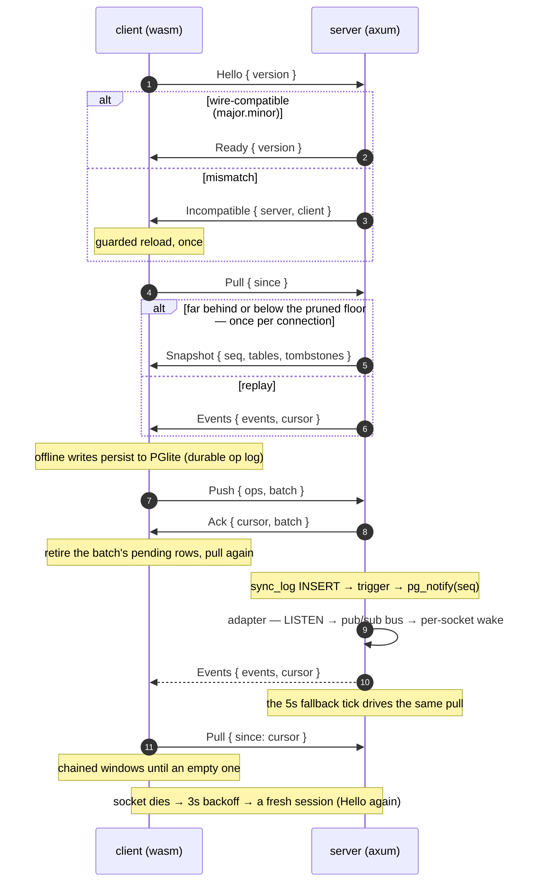

# oxylite

Offline-first sync for **real Postgres** and **PGlite** (Postgres in the
browser, persisted to IndexedDB). One library owns the whole sync
protocol — durable op log, LWW conflict resolution, tombstones,
snapshots, pub/sub-driven push, schema-evolution handshake — generic over
your tables. The notes app in this repo is the proof vehicle that keeps
it honest; a consuming app implements its row types and plugs in.

| Piece       | Tech                                                                |
| ----------- | ------------------------------------------------------------------- |
| The library | `oxylite` (this repo, published to crates.io)                       |
| Server side | sqlx (Postgres 16) + an optional axum transport                     |
| Client side | wasm: PGlite bridge, sync engine, reactive queries                  |
| Real-time   | Postgres `LISTEN/NOTIFY` → in-process pub/sub bus → per-socket wake |

## What it does

- **Offline-first with a durable op log** — writes land in local PGlite
  first, are persisted *before* any send, and retire only when the server
  acknowledges them. An offline write in any tab survives reloads and
  crashes; at-least-once redelivery is harmless by construction.
- **LWW + tombstones** — every op carries its own timestamp; deletes are
  ops whose payload is `null`; every upsert checks a tombstone first, so
  a stale edit can never resurrect a deleted row.
- **Real-time push, not polling** — a trigger on the sync log publishes
  the seq via `LISTEN/NOTIFY`; one listener adapter feeds an in-process
  bus; every connected socket holds an RAII subscription and pulls on
  wake. A slow fallback tick is the safety net, configurable per
  deployment. Measured: commit→receipt in single-digit-to-tens of
  milliseconds under load.
- **Snapshots for far-behind clients** — a client whose backlog outgrew
  replay (or whose needed seq was pruned) gets full state in one frame,
  inside one transaction, tombstones included.
- **Multi-tab, single-writer** — one leader tab owns the database
  (elected via Web Locks); followers proxy over BroadcastChannel.
- **Schema evolution** — the wire version is compared (major.minor) on
  connect; stale bundles reload once, guarded, instead of limping along.
- **Typed errors** — no bare strings; failures surface where the
  embedding app can parse them.
- **Pruning** — the sync log can be trimmed by age; a client left behind
  the pruned floor is detected and snapshotted, never silently diverged.

The library owns its protocol tables in their own Postgres schema
(`oxylite`), so it never collides with your app's tables. Migrations are
generated by a build script — adding a file is the whole job, and naming
violations fail the build.

## Using it

The library's boundary is deliberately small. The lib owns protocol,
engine, reactivity, and transport; **the app owns its tables** — one row
impl feeds both sides, and a new synced table is a row impl plus one
match arm.

Server (axum flavor):

```rust
// the app's plug-ins: an apply arm per table + a snapshot extractor
oxylite::ws::sync_router(db, Apply, Snapshots, schema_version, fallback_tick)
```

Client (wasm):

```rust
oxylite::engine::init::<Table>(MIGRATIONS, SCHEMA_VERSION)?;
oxylite::engine::<Table>().register_sink(Table::Notes, notes_sink());
oxylite::engine::<Table>().run().await;
```

The reference hookup is the demo itself:

- `crates/shared/src/lib.rs` — the table enum, the `SyncRow` impl for
  `Note`, and the app's migrations (concatenated with the lib's).
- `crates/server/src/sync.rs` — the `OpApply` + snapshot plug-ins and
  the migrator over the merged migration list.
- `crates/client` — the Dioxus consumer.

Wire protocol (JSON over one websocket; every session opens with the
handshake):



The client feature (wasm) needs the vendored PGlite bundle served
somewhere reachable — vendor it from npm (`@electric-sql/pglite`) as the
demo's `scripts/vendor-pglite.sh` does. The library itself embeds only
the boot snippet; the 17MB bundle never ships in the crate.

## The demo / testing application

This repository doubles as the library's proof vehicle: an offline-first
notes app (Dioxus UI, PGlite in IndexedDB, axum server) plus a Playwright
suite that exercises the library end to end — offline queues, multi-tab,
deletes, snapshot recovery, schema handshakes, real outages, and
latency contracts measured in CI.

```bash
./scripts/dev.sh                 # hot-reload dev loop (dx on :8081, server on :3000)
./scripts/browser.sh             # one command: postgres + server + built client
podman compose up -d             # Postgres (COMPOSE=docker compose on CI)
./scripts/vendor-pglite.sh       # one-time: vendor PGlite into crates/oxylite/assets
./scripts/serve-server.sh        # serves app + pglite + ws on :3000
```

Single-origin on `http://localhost:3000`: the built client, the vendored
PGlite bundle, and the websocket. Open it, add notes, kill the server,
keep writing — everything persists locally and syncs when the server
returns.

## Tests

```bash
./test.sh                        # everything: lint (fmt, clippy, Rust suites) + e2e
./test.sh --e2e                  # Playwright only (bun); manages the stack itself
./test.sh --e2e tests/sync/delete.spec.ts   # args pass through to playwright
```

26 Playwright specs in `app/` (UI behavior) and `sync/` (offline queue,
multi-tab, delete/tombstone contracts, snapshot bootstrap, outages, and
the latency contract: commit→receipt measured as a distribution).
Rust
contracts are integration targets in `crates/*/tests/` — delete
semantics, generated-SQL shapes, the pub/sub bus, pubsub live tests,
retention, schema handshakes, and a suite that PREPARE-checks every
generated client statement against the migrated schema. CI (GitHub
Actions) runs the whole gate on every PR and publishes the library on
`oxylite-v*` tags — cut a release with `scripts/release.sh` (suggests
patch/minor/major, verifies the package locally, then tags).

## Notes

- **License** — Apache-2.0 (see `LICENSE`). The vendored PGlite bundle
  (`crates/oxylite/assets/pglite/`, from `@electric-sql/pglite`) keeps
  its own Apache-2.0 license text vendored alongside it per §4a; the
  WASM-compiled PostgreSQL inside it carries the permissive PostgreSQL
  Licence. The bundle is demo-only and excluded from the published
  crate.
- **Tokio does not run in the browser.** Client async work uses
  wasm-bindgen-futures / dioxus' web runtime; tokio is the server
  runtime.
- PGlite's `dataDir` **must** be `idb://...` — the default constructor
  is an in-memory filesystem.
